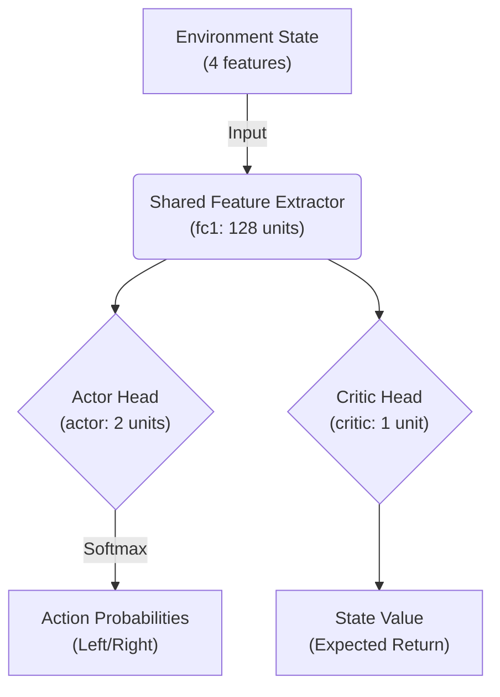

# Actor-Critic Reinforcement Learning for CartPole

This repository contains a simple, beginner-friendly implementation of the **Actor-Critic** Reinforcement Learning algorithm using PyTorch and Gymnasium. The agent learns to solve the classic `CartPole-v1` environment.

## 🧠 What is Actor-Critic?

In Reinforcement Learning, there are generally two main approaches:
1. **Value-Based:** Learning the "value" of each state (e.g., Q-Learning, DQN).
2. **Policy-Based:** Learning the exact "action" to take in each state (e.g., REINFORCE).

**Actor-Critic combines both approaches!**
Imagine learning to ride a bike with an instructor:
* **The Actor (The Student):** Controls the bike, deciding whether to lean left or right. It learns the *Policy* (which action to take).
* **The Critic (The Instructor):** Doesn't control the bike, but watches the student and evaluates how well they are doing. It learns the *Value* (how good the current situation is).

By working together, the Critic provides feedback (Advantage) to the Actor, allowing the Actor to learn much faster and more stably than it would on its own.

## 🏗️ Neural Network Architecture

The model is built using PyTorch and consists of a single Neural Network that splits into two "heads". 



1. **Shared Feature Extractor (`fc1`):** 
   Both the Actor and the Critic need to understand the environment. Instead of learning the state representations separately, they share a dense layer. This layer takes the 4 environment variables (position, velocity, angle, angular velocity) and extracts 128 "features".
2. **Actor Head (`actor`):**
   Takes the 128 features and outputs 2 numbers. A Softmax function is applied to convert these numbers into a probability distribution (e.g., 70% chance to go Left, 30% chance to go Right).
3. **Critic Head (`critic`):**
   Takes the same 128 features and outputs a single real number representing the expected total future reward from that state.

## ⚙️ Implementation Details

The implementation is a variant of **Actor-Critic using Monte Carlo returns** (often resembling REINFORCE with a baseline).

### 1. The Environment
We use `CartPole-v1` from Gymnasium.
* **State:** A continuous array of 4 values.
* **Action:** A discrete choice of 0 (Push Left) or 1 (Push Right).
* **Reward:** +1 for every step the pole remains upright.
* **Solved Condition:** Achieving an average reward of 475+ over 100 consecutive episodes.

### 2. The Training Loop
* **Playing:** The agent plays an entire episode until the pole falls over or the time limit is reached. At each step, it saves its *action probability*, the *Critic's estimated value*, and the *actual reward* received.
* **Calculating Returns:** After the episode ends, we calculate the cumulative discounted reward (Return) for each step backwards. We normalize these returns to keep the training math stable.
* **Calculating Advantage:** `Advantage = Actual Return - Critic's Expected Value`.
    * If `Advantage > 0`: The Actor did *better* than the Critic expected. We should increase the probability of that action.
    * If `Advantage < 0`: The Actor did *worse* than expected. We should decrease that probability.

### 3. The Losses
* **Actor Loss:** `-log_prob(action) * Advantage`. PyTorch minimizes loss, so a negative sign ensures we maximize expected reward.
* **Critic Loss:** `Smooth L1 Loss (Huber Loss)` between the actual returns and the Critic's predictions. This teaches the Critic to guess closer to reality next time.

Both losses are combined and backpropagated together to update the shared weights, Actor weights, and Critic weights simultaneously.

## 🚀 How to Run

1. Activate the virtual environment (which contains PyTorch, Gymnasium, Matplotlib, and Imageio):
```bash
source venv/bin/activate
```

2. Run the training script:
```bash
python actor_critic.py
```

3. **Output:**
* The script will print the training progress every 50 episodes.
* Once solved, it will generate a `training_curve.png` plot showing the learning progress.
* It will also run a deterministic evaluation of the trained agent and save it as `cartpole_agent.gif`.
