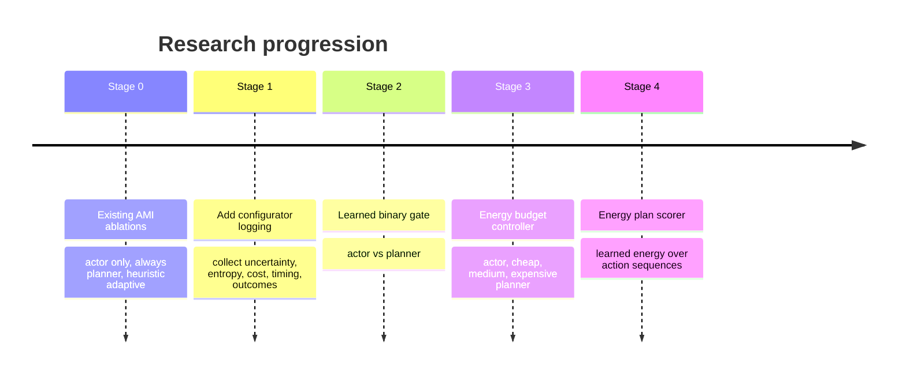
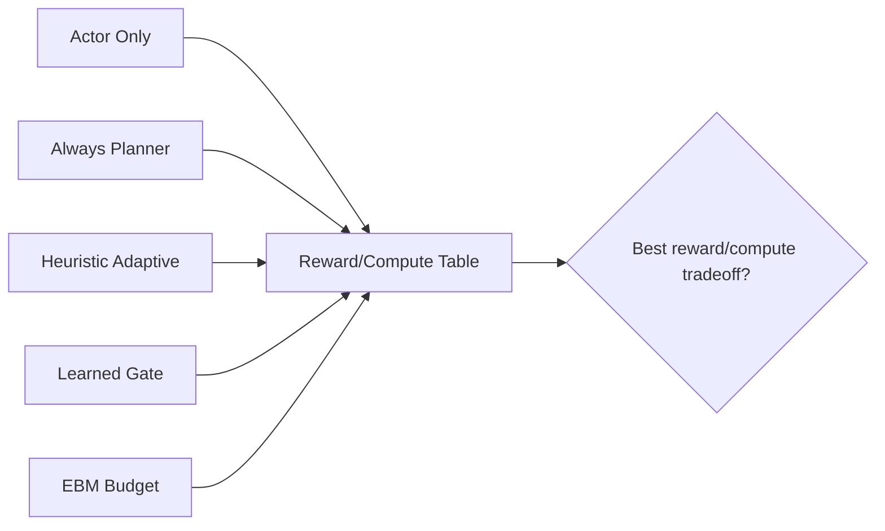
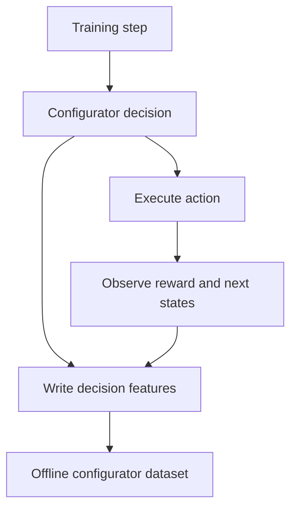
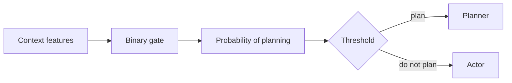
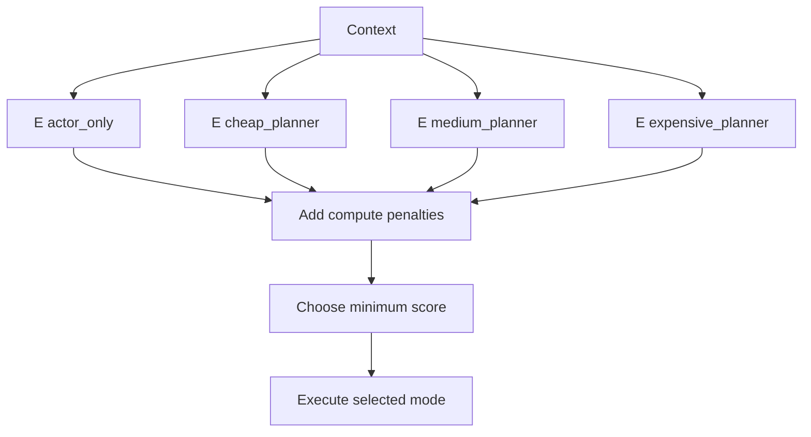
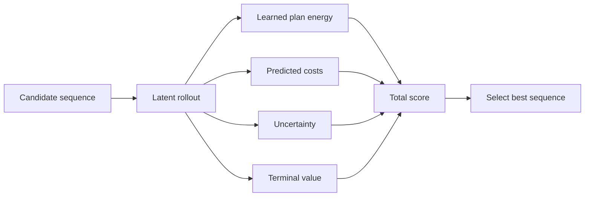
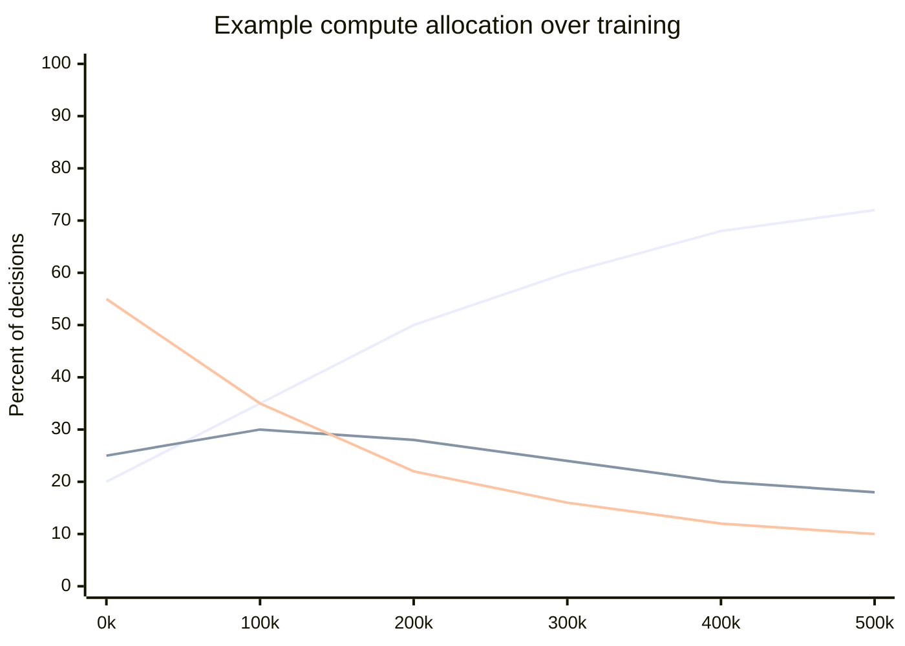

# Configurator Experiment Plan

This document turns the advanced configurator idea into testable FYP
experiments for the Breakout AMI agent.

The goal is not to beat Atari state of the art. The goal is to make a defensible
research claim about adaptive planning:

```text
Can a learned configurator spend planning compute only when it improves the
reward/compute tradeoff?
```

## 1) Experiment Ladder

Run the conditions in stages so each result has a clear interpretation.

| Stage | Condition | Purpose |
|---|---|---|
| 0 | Actor only | lower compute baseline |
| 0 | Always planner | upper planning-cost reference |
| 0 | Heuristic adaptive | current proposed method |
| 1 | Heuristic adaptive plus richer logging | no behavior change, builds dataset |
| 2 | Learned binary gate | learned actor/planner decision |
| 3 | Energy-based budget configurator | learned choice over compute levels |
| 4 | Energy-based plan scorer | optional advanced planner scoring |



## 2) Main Conditions

| Condition | Configurator type | Planning budget | Expected interpretation |
|---|---|---|---|
| AMI Actor Only | none | 0 | distilled policy baseline |
| AMI Always Planner | none | maximum | strongest planning reference |
| AMI Adaptive Heuristic | threshold rule | fixed planner | current main method |
| AMI Learned Gate | classifier or energy over two modes | actor/planner | tests whether data improves gating |
| AMI EBM Budget | energy over modes | variable | tests compute allocation |



## 3) Proposed CLI Extensions

These are suggested flags for a future implementation.

```bash
--configurator-type heuristic
--configurator-type learned-gate
--configurator-type ebm
```

Budget-mode flags:

```bash
--planning-budget-modes actor,cheap,medium,expensive
--cheap-planner-horizon 4
--cheap-planner-sequences 64
--medium-planner-horizon 8
--medium-planner-sequences 256
--expensive-planner-horizon 12
--expensive-planner-sequences 512
```

Learning and exploration flags:

```bash
--configurator-probe-rate 0.05
--configurator-update-frequency 1000
--configurator-batch-size 128
--compute-cost-weight 0.1
--configurator-margin 1.0
```

Logging flags:

```bash
--configurator-log
--configurator-save-dataset
--configurator-eval-breakdown
```

## 4) Stage 1: Instrumentation First

Before changing decisions, log the information needed to train and analyze the
configurator.

New file:

```text
configurator_log.csv
```

Recommended columns:

| Column | Description |
|---|---|
| `global_step` | agent step |
| `mode` | selected compute mode |
| `planned` | whether planner was used |
| `planning_horizon` | actual horizon |
| `num_sequences` | candidate sequences sampled |
| `model_uncertainty` | ensemble disagreement |
| `actor_entropy` | policy entropy |
| `critic_value` | predicted cost-to-go |
| `actor_predicted_cost` | estimated actor action cost |
| `planner_predicted_cost` | estimated best plan cost |
| `planner_actor_gap` | actor cost minus planner cost |
| `decision_wall_time_ms` | action-selection latency |
| `reward_after_1` | immediate reward |
| `reward_after_20` | short-horizon realized reward |
| `life_lost_after_20` | risk outcome |



Acceptance for Stage 1:

- `configurator_log.csv` is written for all AMI runs.
- Existing reward curves are unchanged.
- The report can plot planning rate against uncertainty, entropy, and critic
  value.

## 5) Stage 2: Learned Binary Gate

The learned binary gate chooses:

```text
actor or planner
```

Training labels can be produced from the logging dataset.

Simple label:

```text
planner_good = planner_predicted_cost + compute_penalty < actor_predicted_cost
```

Better label:

```text
planner_good = realized_short_horizon_benefit - compute_penalty > 0
```



Metrics:

- final evaluation reward,
- planning rate,
- reward per planner call,
- wall-clock hours,
- gate accuracy against held-out labels,
- false positive planning rate,
- false negative no-planning rate.

## 6) Stage 3: Energy-Based Budget Configurator

The EBM budget configurator chooses:

```text
actor_only
cheap_planner
medium_planner
expensive_planner
```

Selection rule:

```text
selected_mode = argmin_mode E(context, mode) + lambda_compute * compute_cost(mode)
```



Suggested compute costs:

| Mode | Normalized compute cost |
|---|---|
| `actor_only` | 0.00 |
| `cheap_planner` | 0.25 |
| `medium_planner` | 0.60 |
| `expensive_planner` | 1.00 |

Training loss:

```text
L = softplus(E(context, good_mode) - E(context, bad_mode) + margin)
```

Evaluation questions:

- Does the EBM select expensive planning mainly in high-risk states?
- Does it use cheap planning for ambiguous but not dangerous states?
- Does it reduce full-planner calls without losing much reward?
- Does reward per wall-clock hour improve?

## 7) Stage 4: Energy-Based Plan Scorer

This is optional and should come after the configurator works.

Current planner score:

```text
cost_model rollout + uncertainty penalty + critic terminal value
```

Energy-augmented score:

```text
E_plan(latent, action_sequence)
+ cost_model rollout
+ uncertainty penalty
+ critic terminal value
```



Only include this in the main FYP if the earlier stages are stable.

## 8) Main Metrics

Use the same core metrics as the Breakout experiment plan:

- final full-game evaluation reward mean and standard deviation,
- learning curve every 50k steps,
- planning rate over training and evaluation,
- wall-clock time to reward thresholds,
- reward per planning cost,
- reward per wall-clock hour.

Configurator-specific metrics:

- mode distribution,
- mean compute cost per action,
- planner call concentration in high-uncertainty states,
- actor entropy at planned vs unplanned states,
- critic value at planned vs unplanned states,
- predicted planner benefit versus realized benefit,
- energy gap between selected and rejected modes,
- calibration plot of predicted planning benefit.



## 9) Report Tables

Main table:

| Method | Final reward | Planning rate | Wall-clock hours | Reward/hour | Reward/planning rate |
|---|---:|---:|---:|---:|---:|
| Actor only | TBD | 0.00 | TBD | TBD | n/a |
| Always planner | TBD | 1.00 | TBD | TBD | TBD |
| Heuristic adaptive | TBD | TBD | TBD | TBD | TBD |
| Learned gate | TBD | TBD | TBD | TBD | TBD |
| EBM budget | TBD | TBD | TBD | TBD | TBD |

Decision analysis table:

| Method | Mean uncertainty when planning | Mean actor entropy when planning | Full-planner share | Cheap-planner share |
|---|---:|---:|---:|---:|
| Heuristic adaptive | TBD | TBD | n/a | n/a |
| Learned gate | TBD | TBD | n/a | n/a |
| EBM budget | TBD | TBD | TBD | TBD |

## 10) Success Criteria

Minimum success:

```text
The learned configurator matches heuristic adaptive reward while reducing
planning rate or wall-clock time.
```

Strong success:

```text
The EBM budget configurator reaches close to always-planner reward with much
lower planning cost.
```

Very strong success:

```text
The EBM budget configurator improves both final reward and reward per compute
against the heuristic adaptive condition.
```

Negative but still useful result:

```text
The heuristic configurator remains stronger, showing that learned compute
control is sensitive to noisy labels, sparse rewards, or model error.
```

That is still publishable FYP analysis because it identifies exactly where the
AMI configurator needs improvement.

## 11) Recommended Dissertation Claim

If the advanced configurator is implemented, frame it like this:

```text
This work extends the LeCun-AMI-inspired Atari agent with a learned
compute-aware configurator. The configurator is evaluated as a decision module
that allocates planning budget according to uncertainty, actor confidence,
critic risk, and predicted planning benefit. An energy-based variant selects
the lowest-energy compute mode after applying an explicit compute penalty,
directly testing whether deliberation can be allocated adaptively rather than
used uniformly.
```

