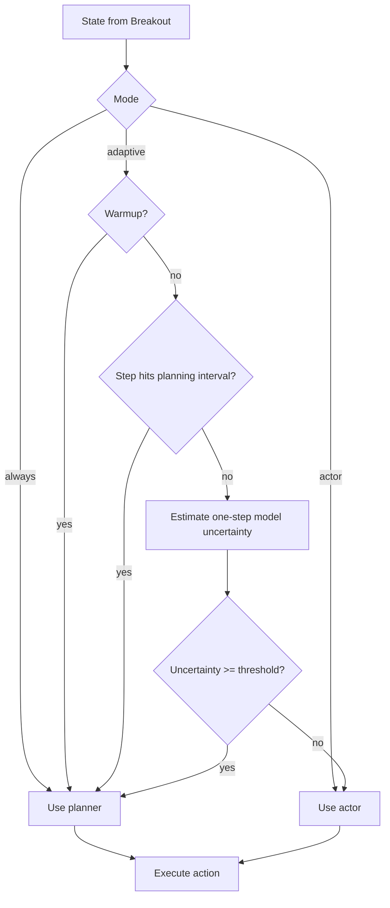
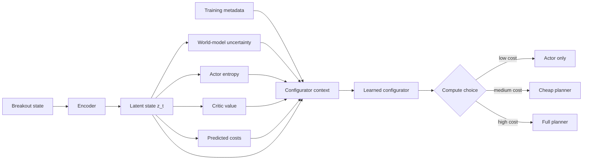
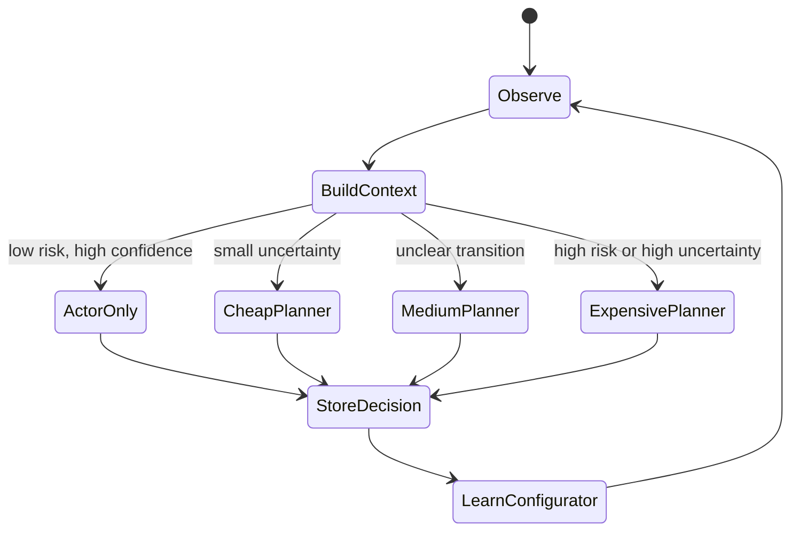
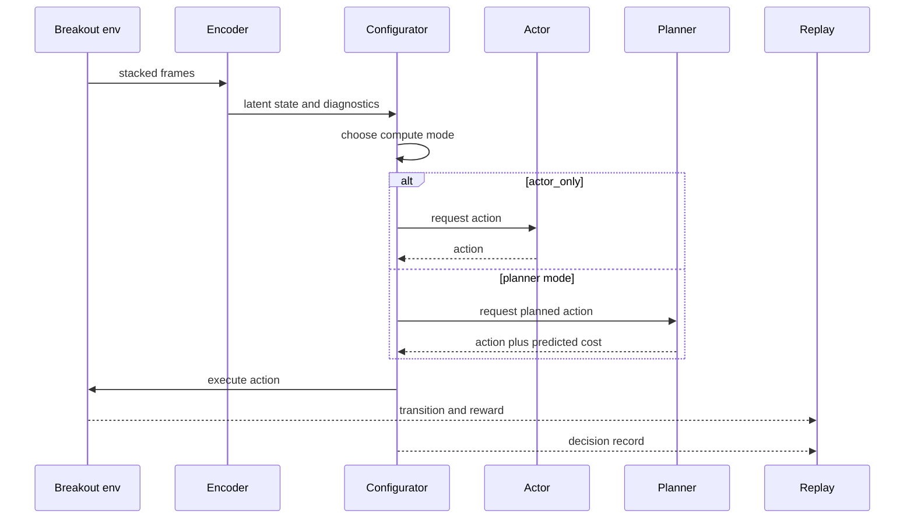
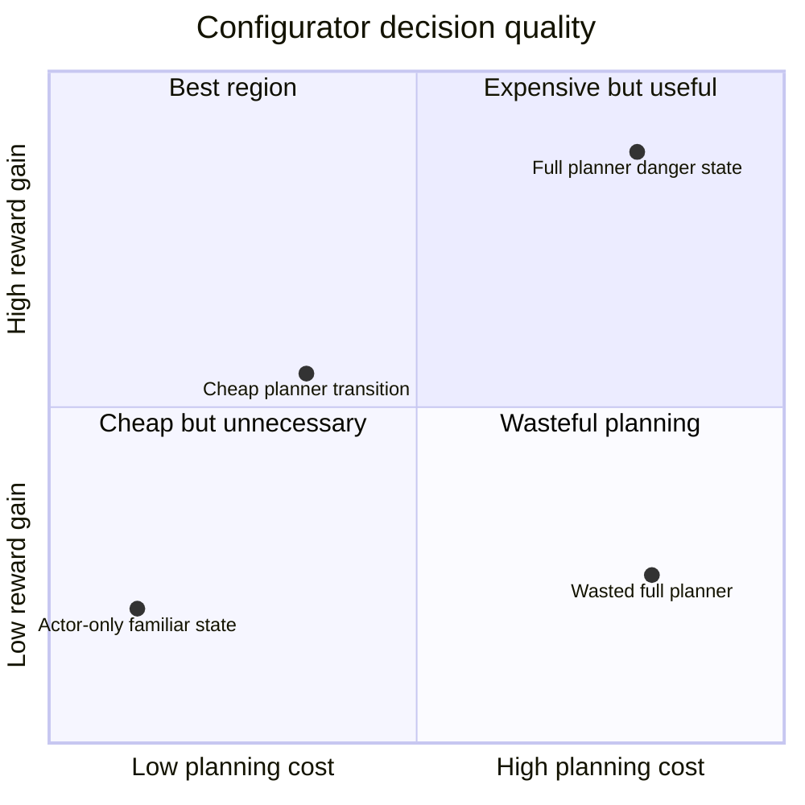
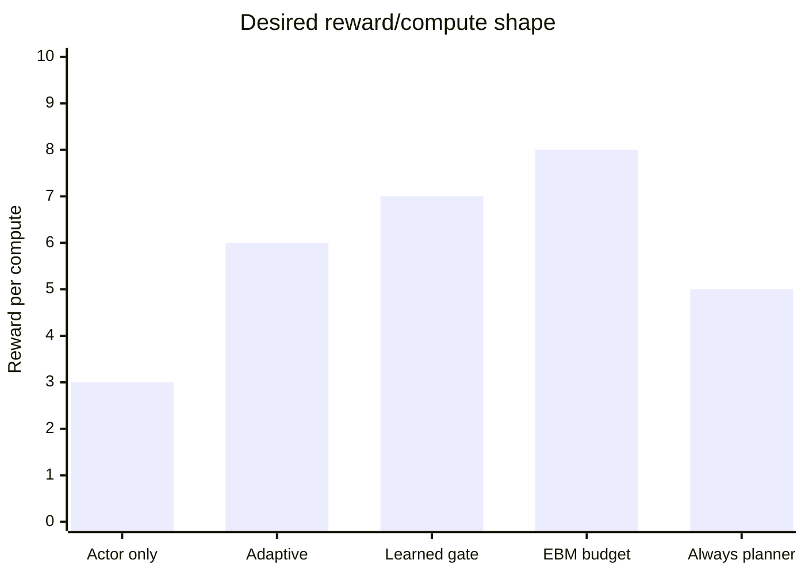

# Advanced Configurator Research Design

This document explains how to turn the current AMI configurator from a simple
heuristic switch into a more research-focused compute controller.

The current Breakout claim is:

```text
adaptive planning should give a better reward/compute tradeoff than always
planning or actor-only behavior
```

The next research step is to make the configurator itself learn when planning is
worth the cost.

## 1) Current Configurator

In `lecun_ami_atari.py`, the configurator is implemented by `should_plan()`.
It decides between:

- `actor`: fast reactive action from the learned policy,
- `planner`: slower latent-space action search.

The current adaptive rule plans when one of these conditions is true:

- training is still in warmup,
- the step is on a fixed planning interval,
- world-model ensemble uncertainty is above a threshold.



This is a strong first FYP baseline because it is easy to explain and easy to
ablate. But it is still a hand-written rule. A stronger research contribution
would ask:

```text
Can the agent learn the value of spending compute?
```

## 2) Practical Intuition

Think of the configurator as a compute manager.

The actor is cheap. It is useful when the state is familiar, the ball is moving
predictably, or the action is obvious.

The planner is expensive. It is useful when the model is uncertain, the ball is
near the paddle, the critic predicts danger, or the actor is not confident.

The configurator should learn a question like this:

```text
Would planning here improve the expected outcome enough to justify the extra
time?
```

That makes the configurator more than a threshold. It becomes a learned
controller over deliberation.

## 3) Better Configurator Inputs

The current configurator mainly uses ensemble uncertainty and periodic planning.
A research-focused configurator should receive a richer context vector.

| Signal | Practical meaning | Why it helps |
|---|---|---|
| latent state `z_t` | compact screen representation | lets the gate learn state-dependent planning needs |
| model uncertainty | how much world models disagree | high uncertainty often means planning may help |
| actor entropy | how unsure the actor policy is | uncertain actor decisions are good planner candidates |
| critic value | predicted future cost | high-risk states may deserve more compute |
| predicted actor cost | cost if the actor action is followed | identifies weak actor decisions |
| predicted planner cost | cost of best planned sequence | estimates possible planning benefit |
| planner actor gap | planner score minus actor score | direct measure of whether planning changed the decision |
| recent reward trend | short-term training progress | avoids spending compute where it is not helping |
| episode step | early, mid, or late life context | Breakout risk changes across an episode |
| epsilon | exploration level | high epsilon may make planning less meaningful |
| replay size | training maturity | early models may make poor plans |
| budget used | current compute pressure | supports compute-aware decisions |



## 4) From Binary Gate To Budget Controller

The current configurator chooses:

```text
actor or planner
```

A stronger research version can choose:

```text
actor only
cheap planner
medium planner
expensive planner
```

Example budget modes:

| Mode | Example settings | Intended use |
|---|---|---|
| `actor_only` | no planner | familiar states, low uncertainty |
| `cheap_planner` | horizon 4, 64 sequences | quick lookahead when mildly uncertain |
| `medium_planner` | horizon 8, 256 sequences | important states with moderate uncertainty |
| `expensive_planner` | horizon 12, 512 sequences | risky or unfamiliar states |



This is a better FYP research object because the question becomes measurable:

```text
Does the configurator learn to allocate planning budget where it has the
highest marginal value?
```

## 5) Candidate Configurator Designs

| Design | What it learns | Research value | Risk |
|---|---|---|---|
| heuristic adaptive | nothing, hand-written rule | clean baseline | limited novelty |
| feature heuristic | weighted score from richer signals | easy improvement | still manually designed |
| binary classifier | actor vs planner | simple learned gate | needs labels |
| contextual bandit | reward/compute outcome per mode | naturally compute-aware | credit assignment is noisy |
| energy-based configurator | compatibility energy for each compute mode | closest to AMI style | needs careful negative sampling |
| meta-RL controller | policy over compute decisions | most flexible | high complexity for FYP |

Recommended path:

```text
heuristic adaptive -> learned binary gate -> energy-based budget controller
```

## 6) Proposed Module Interface

The cleanest implementation is to keep the existing planner and actor, then add
a configurator module around them.

```text
context_t = build_configurator_context(state, latent, actor, critic, models)
mode_t = configurator.select_mode(context_t)
action_t = execute_mode(mode_t)
configurator.store_decision(context_t, mode_t, outcome_t)
configurator.update()
```



## 7) What To Log

Add a new file such as `configurator_log.csv`.

Recommended columns:

| Column | Meaning |
|---|---|
| `global_step` | agent step |
| `episode` | training episode or life segment |
| `mode` | actor, cheap planner, medium planner, expensive planner |
| `planned` | boolean |
| `planning_horizon` | horizon used for this decision |
| `num_sequences` | candidate sequences used |
| `model_uncertainty` | ensemble disagreement |
| `actor_entropy` | policy uncertainty |
| `critic_value` | predicted future cost |
| `actor_predicted_cost` | predicted score for actor action |
| `planner_predicted_cost` | predicted score for selected plan |
| `planner_actor_gap` | actor score minus planner score |
| `wall_time_ms` | decision latency |
| `reward_after_1` | immediate reward |
| `reward_after_k` | short-horizon realized reward |
| `life_lost_after_k` | whether the decision led to a life loss soon |

This log is important because it lets the dissertation explain not just final
reward, but when the configurator decided to spend compute.

## 8) Visual Analysis For Reports

Useful report visualizations:





The expected research story is not that the learned configurator always gets
the highest raw reward. The better story is that it gets close to planner reward
while using much less planning compute.

## 9) Main Research Hypotheses

H1:

```text
A learned configurator reduces unnecessary planning compared with the heuristic
adaptive gate.
```

H2:

```text
An energy-based configurator improves reward per unit compute compared with
actor-only, always-planner, and threshold-based adaptive planning.
```

H3:

```text
Planner calls become concentrated in high-uncertainty or high-risk Breakout
states after configurator learning.
```

## 10) Practical Recommendation

For the FYP, implement this in stages.

1. First add richer configurator logging without changing behavior.
2. Then train a learned binary actor/planner gate offline from the logs.
3. Then replace the binary gate with an energy-based budget controller.
4. Only after that, consider an energy-based plan scorer.

This keeps the project defensible. Each stage has a clean baseline, a measurable
claim, and a fallback if the more advanced module is unstable.

