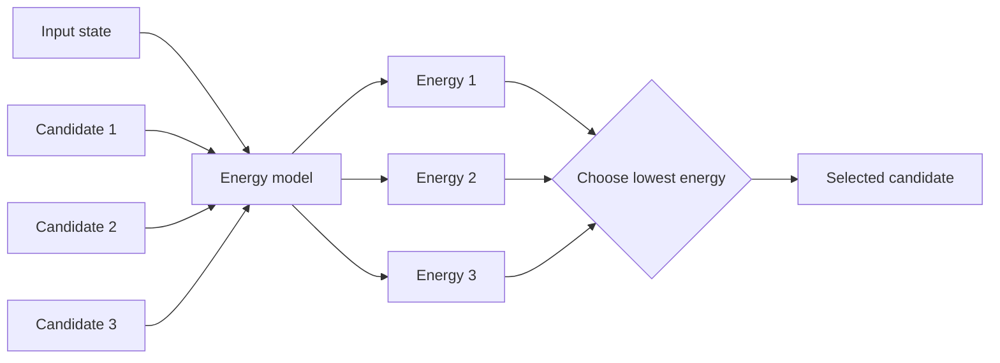
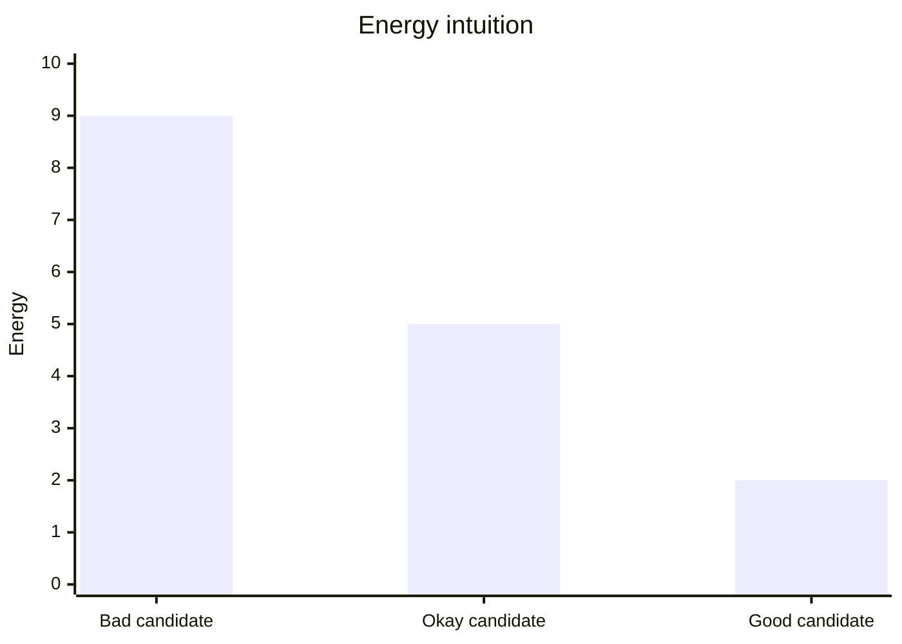
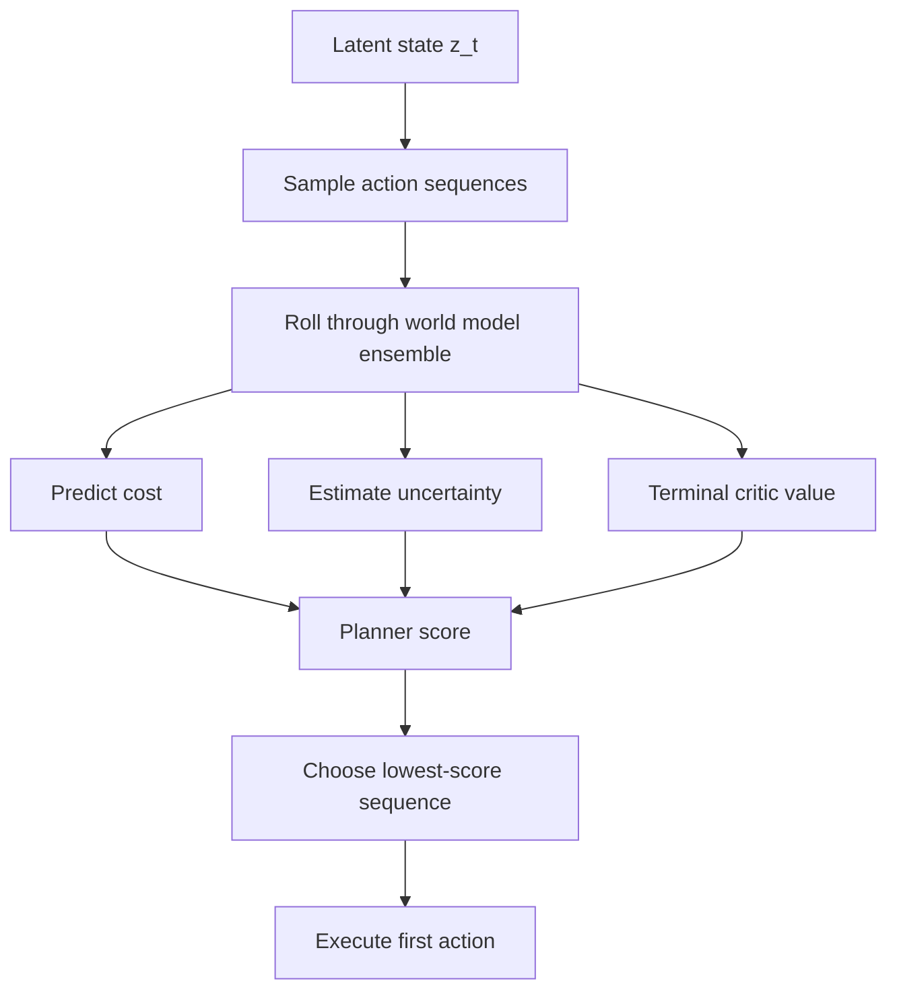
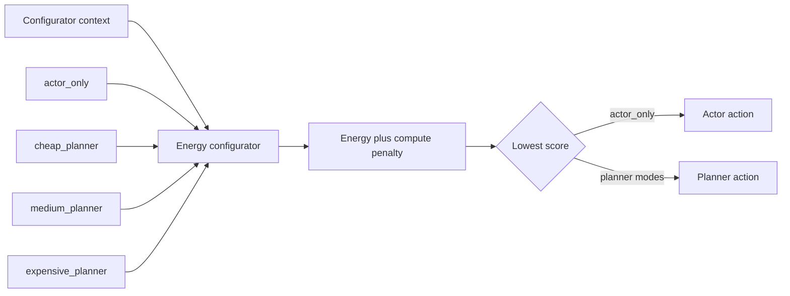
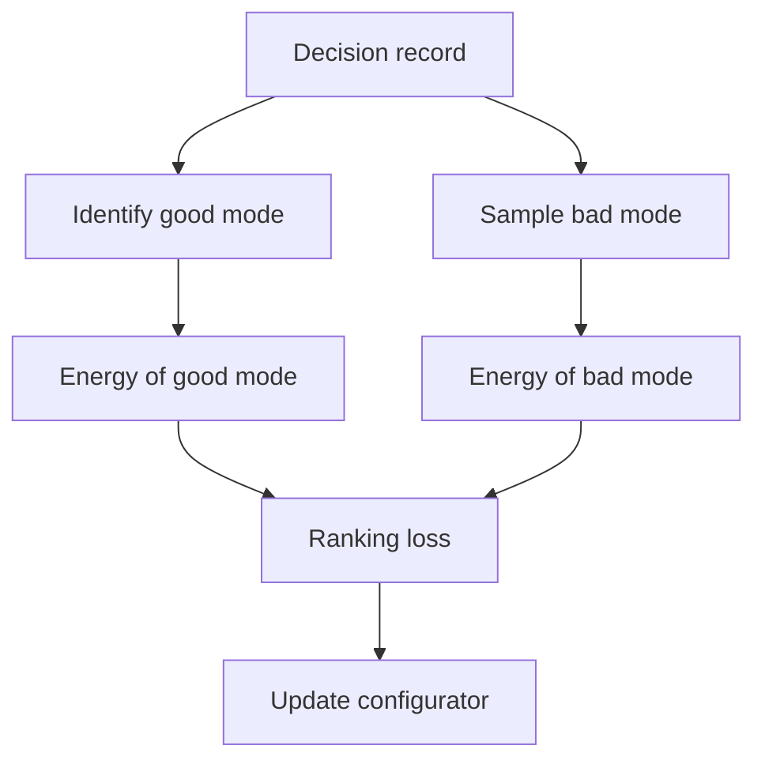
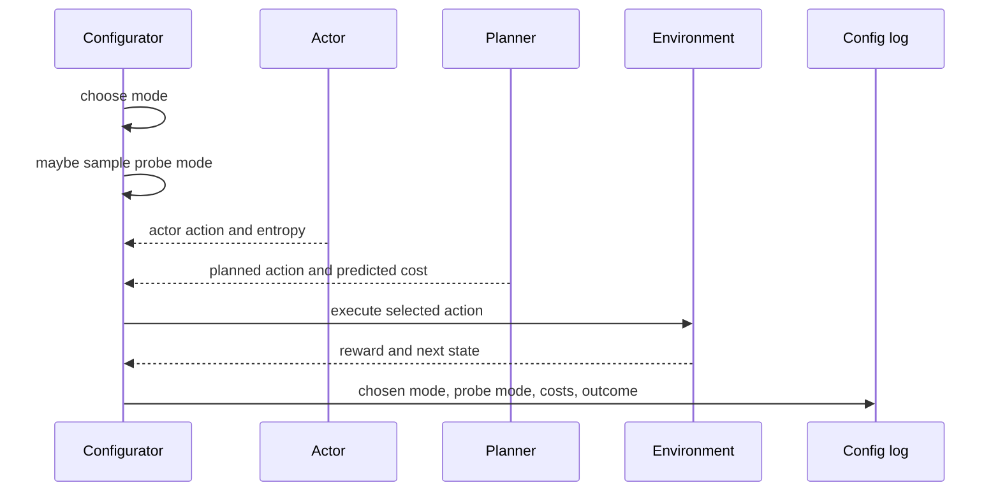
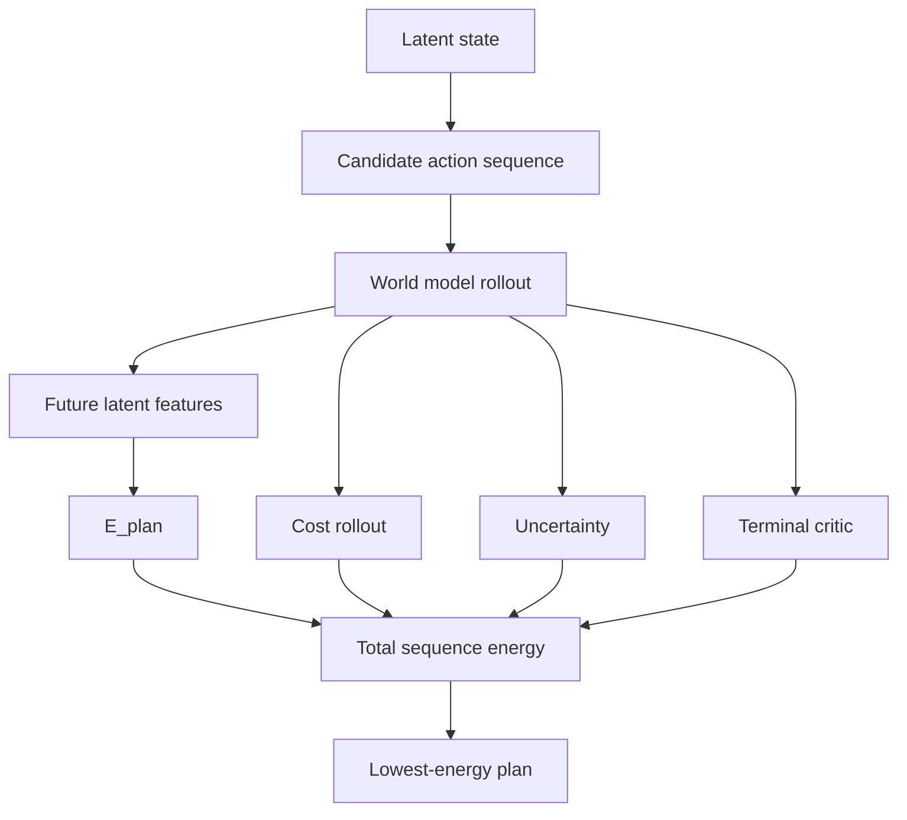
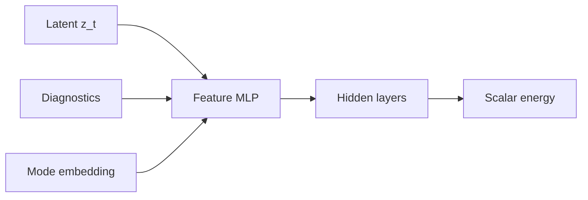

# Energy-Based Learning For LeCun-AMI

This document explains energy-based learning in practical terms and how it can
be used in the LeCun-AMI Breakout agent.

Primary sources:

- LeCun, Chopra, Hadsell, Ranzato, Huang, "A Tutorial on Energy-Based Learning":
  https://yann.lecun.com/exdb/publis/pdf/lecun-06.pdf
- LeCun, "A Path Towards Autonomous Machine Intelligence":
  https://openreview.net/pdf?id=BZ5a1r-kVsf

## 1) What Is Energy-Based Learning?

Energy-based learning trains a model to assign a scalar energy to a possible
answer.

```text
E(input, candidate)
```

Lower energy means the candidate is better, more compatible, or more desirable.
Higher energy means the candidate is worse.

In a normal classifier, the model directly predicts:

```text
probability(action | state)
```

In an energy-based model, the model scores possibilities:

```text
energy(state, action)
```

Then inference chooses the lowest-energy option:

```text
best_action = argmin_action E(state, action)
```



The key difference is that an energy model does not need to output a normalized
probability distribution. It only needs to rank good candidates below bad
candidates.



## 2) Why This Fits LeCun-AMI

LeCun's AMI view emphasizes prediction, latent representations, objectives, and
cost minimization. The agent does not just react. It evaluates possible futures
and chooses actions that lead to lower cost.

The current AMI planner already behaves like an energy minimizer.

In the Atari code, a candidate action sequence is scored by:

```text
predicted immediate costs
+ uncertainty penalty
+ terminal critic value
```

Lower score is better.



So the current planner is already energy-like, even though it is not trained as
a separate EBM.

The research opportunity is to make this explicit in two places:

1. the configurator, which chooses how much compute to spend,
2. the planner, which chooses which imagined future to execute.

## 3) Energy-Based Configurator

The configurator can be written as an energy model:

```text
E_config(context_t, mode)
```

where `mode` is one of:

```text
actor_only
cheap_planner
medium_planner
expensive_planner
```

The agent selects:

```text
mode_t = argmin_mode [E_config(context_t, mode) + lambda_compute * compute_cost(mode)]
```

The compute penalty is important. Without it, the model may learn to always use
the biggest planner because it is safest. The FYP claim needs a tradeoff, not
just maximum reward.



### Practical Breakout Examples

Low energy for actor-only:

```text
ball is far from paddle
actor entropy is low
model uncertainty is low
critic value is safe
```

Low energy for expensive planner:

```text
ball is near paddle
actor entropy is high
model uncertainty is high
critic predicts high future cost
life loss is likely
```

This makes the configurator interpretable. You can inspect which states get low
energy for planning and check whether those states make practical sense.

## 4) Training The Energy Configurator

The configurator needs examples of good and bad compute decisions.

A simple training record:

```text
context_t
chosen_mode
actor_score
planner_score
realized_reward_after_k
life_lost_after_k
wall_time_ms
```

A practical label can be built from estimated planning benefit:

```text
benefit(mode) = realized_reward_after_k - compute_penalty(mode)
```

If a planner mode has higher benefit than actor-only, it should receive lower
energy.

### Ranking Loss

Energy-based learning commonly uses contrastive or ranking losses. For the
configurator:

```text
L = softplus(E_config(context, good_mode)
             - E_config(context, bad_mode)
             + margin)
```

This pushes the good mode energy below the bad mode energy.



## 5) Where Do Counterfactuals Come From?

The hard question is:

```text
How do we know what would have happened if the agent had selected a different
compute mode?
```

You cannot observe every mode at every state during normal training. Use a
small number of probe decisions.

Example:

```text
95 percent of the time: use the current configurator decision
5 percent of the time: evaluate an alternative mode for learning
```

Probe options:

- compare actor action score against planner score in the learned model,
- occasionally force actor-only where the gate would plan,
- occasionally force cheap planner where the gate would use actor-only,
- run planner internally but execute actor action, storing the planner estimate
  as a counterfactual label.



This gives the energy model enough contrastive data without turning every step
into an always-planner run.

## 6) Energy-Based Plan Scorer

The second possible upgrade is to learn:

```text
E_plan(z_t, action_sequence)
```

Instead of scoring a sequence only with hand-composed predicted costs, the agent
would learn an energy for whole imagined futures.

Possible planner score:

```text
score(sequence) =
    E_plan(z_t, sequence)
    + predicted_cost_rollout
    + uncertainty_penalty
    + terminal_critic_value
```



This is more ambitious than the configurator upgrade. It can improve planning
quality, but it also adds more instability because bad learned energies can
mislead the planner.

Recommended order:

```text
first E_config, later E_plan
```

## 7) Model Architecture Sketch

A compact energy configurator can be an MLP.

Inputs:

```text
latent features
model uncertainty
actor entropy
critic value
predicted actor cost
predicted planner cost
recent reward statistics
normalized compute budget used
mode embedding
```

Output:

```text
scalar energy
```



Implementation pattern:

```text
repeat context for each mode
attach one mode embedding per row
predict one scalar energy per mode
choose minimum penalized energy
```

## 8) What Makes This Research-Focused?

The current configurator asks:

```text
Is uncertainty above a threshold?
```

The energy-based configurator asks:

```text
Which compute mode has the lowest expected task energy after accounting for
planning cost?
```

That is a stronger research question because it connects:

- representation learning,
- uncertainty,
- planning,
- compute allocation,
- policy distillation,
- cost minimization.

It also gives clearer ablations:

| Method | Question answered |
|---|---|
| actor only | how good is the distilled policy without planning? |
| always planner | what reward is possible with maximum planning? |
| heuristic adaptive | is uncertainty thresholding enough? |
| learned gate | can data improve actor/planner selection? |
| energy configurator | can the agent learn a compute-aware energy landscape? |
| energy planner | can learned energies improve imagined future selection? |

## 9) Risks

Important risks to document:

- The configurator can learn to over-plan if compute cost is too small.
- It can learn to under-plan if compute cost is too large.
- Early planner labels may be poor because the world model is still weak.
- Counterfactual labels are noisy.
- Breakout rewards are sparse, so short-horizon benefit estimates may be weak.
- Extra planner probes increase wall-clock time.

These risks are not a reason to avoid the idea. They are good dissertation
material because they show the tradeoff is real.

## 10) Best FYP Framing

Use this wording:

```text
The proposed extension treats the configurator as an energy-based compute
controller. Instead of invoking planning from a fixed uncertainty threshold, the
agent learns a scalar energy over possible deliberation modes. The selected mode
minimizes predicted task energy plus an explicit compute penalty. This directly
tests whether adaptive planning can be learned as a reward/compute tradeoff.
```

